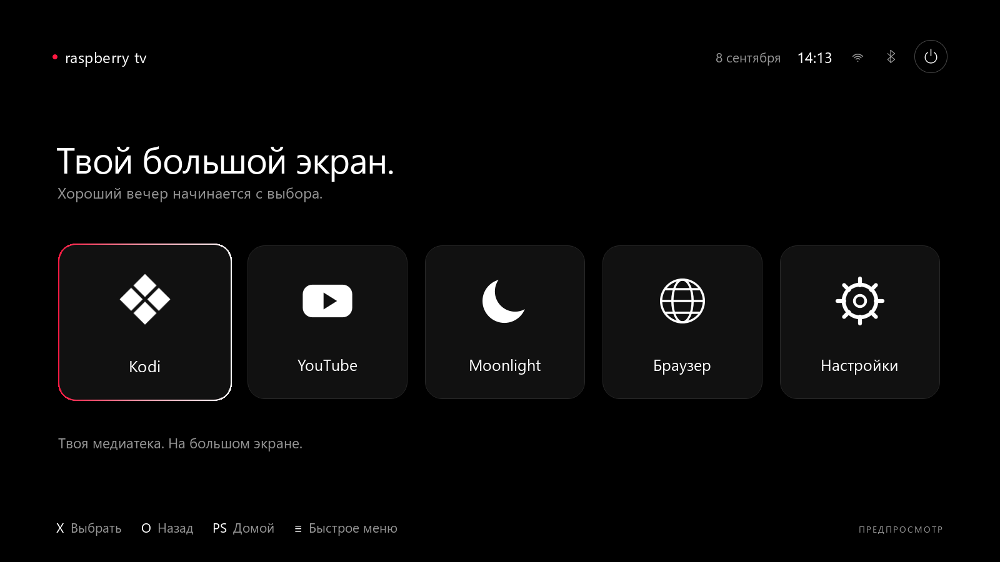

# Raspberry TV

TV-оболочка для **Raspberry Pi 5** с управлением с дивана:
**Kodi · YouTube · Moonlight · Браузер · Настройки**.

Версия **0.1.0**. Рабочая установка проверена на Raspberry Pi OS Lite 64-bit
(Debian 13 Trixie): изображение на телевизоре, Kodi, DualSense по USB/Bluetooth
и YouTube с видео и звуком через zapret. В текущей ветке подготовлена установка
Moonlight Qt; сопряжение с Sunshine подтверждено, игровая приёмка ещё впереди.

В этой ветке добавлен ручной вызов клавиатуры для полей браузера, YouTube и Kodi;
пользователь подтвердил работу 2026-09-09. Запуск Chromium, адреса, история и переходы между окнами проверены на Pi;
управление браузером и меню питания с DualSense подтверждено пользователем.
Реальные перезагрузка и выключение также подтверждены пользователем.
См. [STATUS.md](docs/STATUS.md).

**[Подробная установка с чистой ОС](docs/INSTALL.md)** ·
[Что работает](docs/STATUS.md) · [Будущие изменения](docs/ROADMAP.md)



## Возможности

- Полноэкранный интерфейс Qt Quick: крупные плитки, навигация геймпадом,
  быстрые действия поверх приложений и возврат на главный экран.
- Kodi как отдельный медиаплеер; YouTube через Chromium в kiosk-режиме.
- Отдельный браузер: свой профиль, стартовая страница, ввод адреса экранной
  клавиатурой, история назад/вперёд и обновление через быстрое меню.
- Кнопка питания в углу: выключение и перезагрузка с подтверждением.
  Спящий режим пока недоступен — проверка сна и пробуждения впереди.
- DualSense: кнопки, стики и штатный тачпад, USB и Bluetooth.
- Экранная клавиатура в редакторах оболочки и **Options → Клавиатура** для полей
  браузера, YouTube и Kodi; работа подтверждена пользователем на Pi.
- Настройки сети и устройств, выбор разрешения с независимым откатом.
- Zapret как отдельная системная служба: профили и домены, выбор стратегии,
  GameFilter TCP/UDP, подбор по HTTPS-проверкам и откат изменений.
- Безопасный предпросмотр интерфейса на Windows без изменения системных настроек.

Не все адаптеры прошли полную аппаратную приёмку. HDMI-CEC-пульт,
автоматический вызов клавиатуры, сон
и обновления из GUI пока не реализованы. Подробности — в [STATUS.md](docs/STATUS.md).

## Быстрая установка

Только для **Pi 5 / Raspberry Pi OS Lite 64-bit / Trixie**. Сначала установи ОС,
подключи Pi к сети и включи SSH. Команды ниже выполняются на Pi под обычным
пользователем с sudo, в его домашнем каталоге:

```bash
sudo apt-get update
sudo apt-get install -y git ca-certificates
cd ~
git clone https://github.com/DNA476/RaspberryTV.git
cd RaspberryTV
bash scripts/install-pi.sh --user "$USER" --check
sudo bash scripts/install-pi.sh --user "$USER" --enable-session
sudo reboot
```

Установщик добавляет X11, LightDM, Openbox, Picom, системный Qt, Kodi, Chromium
и другие зависимости. `--enable-session` включает автоматический вход
в TV-сеанс. Код устанавливается в `/opt/raspberry-tv`; готового `.img` нет.

**Zapret устанавливается отдельно**, когда он нужен в твоей сети. Его подготовка,
проверка ARM-стратегий, установка, активация и восстановление описаны в
[инструкции установки](docs/INSTALL.md#5-установи-zapret-если-он-нужен-в-твоей-сети)
и [ZAPRET.md](docs/ZAPRET.md). Для Moonlight выполни отдельно
`sudo bash scripts/install-moonlight-pi.sh`; подключение Sunshine и проверки
описаны в [MOONLIGHT.md](docs/MOONLIGHT.md).

## Управление

| Действие | DualSense | Клавиатура |
| --- | --- | --- |
| Навигация | Крестовина / левый стик | Стрелки |
| Выбрать | X | Enter / пробел |
| Назад | O | Esc |
| Главный экран | Короткое PS | F1 |
| Быстрое меню | Options | F2 |
| Меню питания | Удержание PS | F3 |
| Полный экран видео в браузере / YouTube | Треугольник | F |
| Esc в браузере / YouTube / Kodi | Квадрат | Esc |

Тачпад: прокрутка двумя пальцами инвертирована; физический щелчок в левой половине
даёт ЛКМ, в правой — ПКМ. При перетаскивании выбранная кнопка удерживается до
отпускания, даже если палец пересёк середину. Лёгкое касание не считается щелчком.
В Kodi квадрат возвращает из полноэкранного видео в меню; воспроизведение может
продолжаться в фоне. В Moonlight эти две кнопки остаются доступны игре.
Клавиша F срабатывает на сайтах, где её поддерживает плеер; при вводе в текстовое
поле она вводит букву. Подробности и проверки — [DUALSENSE.md](docs/DUALSENSE.md).

В браузере влево/вправо переключают элементы страницы (Shift+Tab/Tab), вверх/вниз
прокручивают, X активирует выбранный элемент. Options → **Открыть адрес** вызывает
клавиатуру лаунчера; стартовая страница задаётся в **Настройки → Система**.
Её значение по умолчанию — `https://www.google.com/`. YouTube использует свой профиль.
Каждый введённый адрес открывается в новой вкладке браузера.

Для поля сайта, поиска YouTube или Kodi выбери поле и нажми **Options → Клавиатура**.
Набери текст и выбери **Вставить** либо **Вставить и Enter**. Это отдельное действие
от «Открыть адрес». Возможности, ограничения и список ручных проверок —
в [KEYBOARD.md](docs/KEYBOARD.md). Автоматический вызов и Moonlight ещё впереди.

## Предпросмотр на Windows

Нужен Python 3.11+ с командой `py`. Из каталога репозитория в PowerShell:

```powershell
.\scripts\preview.ps1 -Setup
```

Для следующих запусков достаточно `.\scripts\preview.ps1`. Скрипт создаёт `.venv`
и ставит Qt в неё. Предпросмотр не запускает Linux-приложения и не изменяет сеть
или службы Windows; настройки лежат в `.run/preview`.

## Проверки для разработки

После подготовки окружения Windows:

```powershell
.\.venv\Scripts\python.exe -m unittest discover -s tests -v
.\.venv\Scripts\python.exe -m raspberry_tv --screenshot artifacts\home.png
.\.venv\Scripts\python.exe -m raspberry_tv --screenshot artifacts\power.png --screen power
```

На Pi можно проверить ядро без QtTest и без изменения системных служб:

```bash
python3 -m unittest tests.test_core tests.test_processes tests.test_pi_integration tests.test_bluetooth tests.test_zapret tests.test_bridge tests.test_text_input -v
```

Результаты текущих локальных проверок и список проверки браузера на Pi —
в [STATUS.md](docs/STATUS.md). Аппаратные результаты от 2026-09-05 относятся
к версии 0.1.0: 39 тестов ядра и 88 проверок параметров ARM nfqws прошли.
Они не подтверждают новые функции этой ветки.

## Документация

- [Установка, обновление и восстановление](docs/INSTALL.md).
- [Текущая готовность и приёмка](docs/STATUS.md).
- [Будущие изменения](docs/ROADMAP.md).
- [Архитектура](docs/ARCHITECTURE.md).
- [Zapret: источники, ограничения и результаты проверки](docs/ZAPRET.md).
- [Целевое ТЗ](Raspberry-TV-Launcher-SPEC.md) и [визуальный референс](DESIGN.md).

Внешние приложения и движок zapret устанавливаются отдельно. Их исходники,
версии и авторы указаны в документации; ОС, ключи, логи и локальные данные
пользователя в репозиторий не входят.
